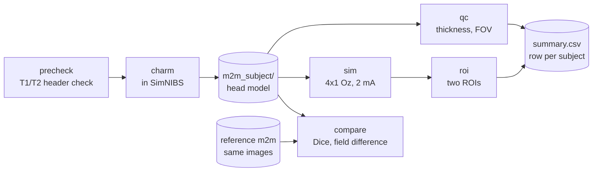

<h1 align="center">simnibs-occipital-tacs</h1>

<p align="center">
  <b>From T1/T2 MRI to a quality-checked head model, a 4×1 Oz field simulation and an ROI summary</b>
</p>

<p align="center">
  <a href="https://simnibs.github.io/simnibs/"></a>
  <a href="LICENSE"></a>
  
  
  
</p>

<p align="center">
  <a href="#what-it-does">What it does</a> &middot;
  <a href="#pipeline">Pipeline</a> &middot;
  <a href="#usage">Usage</a> &middot;
  <a href="#outputs">Outputs</a> &middot;
  <a href="#validation-on-the-simnibs-example-subject">Validation</a> &middot;
  <a href="#limitations">Limitations</a>
</p>

---

Individual head-model pipeline for occipital tACS, built on [SimNIBS 4](https://simnibs.github.io/simnibs/).

One script takes a subject's T1/T2 MRI to a quality-checked head model, an electric-field simulation of a standard occipital 4×1 HD montage, and a one-line-per-subject summary table. It also compares two head models built from the same images, which is how the pipeline's own reproducibility was measured.

Written for a study on personalized occipital alpha tACS in isolated REM sleep behaviour disorder (iRBD) with cognitive decline, but nothing in it is specific to that cohort.

## What it does

| Step | Command | Output |
|---|---|---|
| 1. Input check | `precheck` | Voxel size, field of view, orientation, qform/sform consistency, T1–T2 offset, and the exact `charm` command to run |
| 2. Head model | `charm` (SimNIBS, run directly) | `m2m_<subject>/` — tissue segmentation, FEM mesh, EEG positions, MNI transform |
| 3. Quality check | `qc` | Tissue thickness under each electrode, distance from electrode to the edge of the image, tissue volumes, overlay figure |
| 4. Simulation | `sim` | 4×1 Oz montage, 2 mA, isotropic conductivity |
| 5. ROI summary | `roi` | Volume-weighted mean field and threshold-crossing fractions for two ROI definitions |
| 6. Model comparison | `compare` | Per-tissue Dice (whole head and occipital), ROI field difference |

Results accumulate in `stage1_out/summary.csv`, one row per subject, so a cohort-level criterion such as "≥90% of subjects above X V/m" can be computed directly from that file.

## Pipeline



Arrows show the main input of each command. `all` runs `qc`, `sim` and `roi` in that order on one
`m2m` folder. `compare` also reads the `roi` results of both models when they exist.

## Requirements

- SimNIBS 4.6 (tested on Windows; the code itself is platform independent)
- Run with the Python that ships with SimNIBS: `simnibs_python`
- `numpy`, `nibabel` come with SimNIBS. `matplotlib` is optional and only used for the QC figure:
  `simnibs_python -m pip install matplotlib`

## Usage

```bash
# 0. quick pass on the SimNIBS example subject, using the head model that ships with it
simnibs_python stage1_headmodel.py all --m2m m2m_ernie

# 1. check the images, then build your own head model
simnibs_python stage1_headmodel.py precheck --t1 org/ernie_T1.nii.gz --t2 org/ernie_T2.nii.gz --sub ernie_test
charm ernie_test org/ernie_T1.nii.gz org/ernie_T2.nii.gz          # ~2 h on our workstation

# 2. QC + simulation + ROI summary on the model you built
simnibs_python stage1_headmodel.py all --m2m m2m_ernie_test

# 3. compare the two models
simnibs_python stage1_headmodel.py compare --m2m m2m_ernie_test --ref m2m_ernie
```

`--aniso vn` switches the simulation to anisotropic conductivity where a DTI tensor is available in the `m2m` folder.

## Outputs

```
stage1_out/
├── summary.csv                 # one row per subject
└── <subject>/
    ├── precheck.json
    ├── qc.json                 # per-electrode thickness, tissue volumes, warnings
    ├── thickness.csv
    ├── qc_occipital.png        # sagittal / axial / coronal slices with the segmentation overlaid
    ├── sim_4x1_scalar/         # SimNIBS output (.msh)
    ├── roi_scalar.json
    └── compare_vs_<ref>.json
```

## Two ROI definitions

The electric field near the stimulation target depends strongly on how the ROI is drawn, so `roi` reports both:

- **`mni_r20`** — sphere of radius 20 mm around MNI (0, −80, 25) mapped into subject space. Fixed for continuity with earlier analyses.
- **`oz_r20` / `oz_r10`** — sphere around the grey-matter element closest to the Oz electrode, i.e. the cortex directly under the stimulating electrode.

The JSON also stores the distance between the two centres and the electrode-to-cortex distance, which makes it obvious when a fixed MNI coordinate does not sit under the electrode.

## Thickness measurement

For each electrode the script casts a ray toward the centre of the brain, reads the tissue label every 0.2 mm, and sums the distance spent in scalp, skull and CSF until the first grey/white matter voxel. This is a path length along an oblique ray, not a perpendicular thickness, so use it to compare subjects rather than as an absolute measurement.

> [!WARNING]
> **Midline electrodes (Oz, Pz, POz, Cz, Iz) are a known caveat.** The ray enters the
> interhemispheric fissure, passes through the sagittal sinus and CSF, and reaches cortex
> late. Scalp and skull values are still usable there; CSF and skin-to-cortex are not.
> Compare thickness across subjects using O1/O2.

## Validation on the SimNIBS example subject

Same T1/T2, two head models: the one distributed with SimNIBS (`m2m_ernie`) and one built here with `charm` (`m2m_ernie_test`). Any difference comes from the model-building step alone.

| Dice | whole head | occipital (30 mm around Oz) |
|---|---|---|
| White matter | 0.966 | 0.917 |
| Grey matter | 0.942 | 0.882 |
| CSF | 0.878 | 0.824 |
| Skull | 0.923 | **0.979** |
| Scalp | 0.943 | **0.977** |

ROI mean field (`mni_r20`, 4×1 Oz at 2 mA, isotropic): 0.122 V/m vs 0.128 V/m, a difference of **4.3%**. Treat that as the lower bound on differences this pipeline can resolve between subjects.

The tissues that carry the injected current — occipital skull and scalp — agree almost exactly. The remaining difference is concentrated at the grey-matter/CSF boundary. Part of it may come from the two models being built with different SimNIBS versions; this has not been checked.

## Limitations

- Validated on one young healthy subject. Elderly brains with atrophy, and clinical scans with a restricted field of view, are not covered.
- Isotropic conductivity only in the default run; the effect of DTI anisotropy has not been quantified here.
- Dice against a distributed model measures reproducibility, not accuracy. Accuracy would require intracranial measurements.
- Label numbers for `final_tissues.nii.gz` and the EEG coordinate file format follow the SimNIBS 4 documentation. Check `labels_present` in `qc.json` on the first run with a new SimNIBS version.

## References

- Thielscher A, Antunes A, Saturnino GB. Field modeling for transcranial magnetic stimulation. *IEEE EMBC* 2015. (SimNIBS)
- Puonti O, Van Leemput K, Saturnino GB, Siebner HR, Madsen KH, Thielscher A. Accurate and robust whole-head segmentation from magnetic resonance images for individualized head modeling. *NeuroImage* 2020;219:117044. (charm)

## Note on patient data

> [!IMPORTANT]
> This repository contains code only. Subject images stay on the acquisition or analysis
> workstation; only derived numbers (`summary.csv`, QC values) are meant to leave it.

## License

[MIT](LICENSE)
